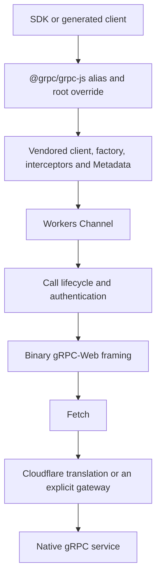

# Architecture

The adapter preserves a selected grpc-js client surface while replacing its native transport with binary gRPC-Web over Fetch. It is a prototype; see [limitations](limitations.md) for the compatibility boundary.

## Request path

The client core comes from the npm artifact `@grpc/grpc-js@1.14.0`. [UPSTREAM.json](../vendor/UPSTREAM.json) records its integrity, commit, file hashes and patches. `node vendor/verify.cjs` checks both original bytes and patch reproduction. Native channel, resolver and server implementations are excluded from the runtime graph.

## Modules

All paths below are relative to `src/`.

| Module | Responsibility |
|---|---|
| `index.ts` | Client exports and explicit failures for server APIs |
| `factory.ts` | Generated constructors, package definitions and original-name aliases |
| `client.ts`, `call-surface.ts` | Upstream overloads, callbacks, streams and invocation transforms |
| `client-interceptors.ts` | Interceptor order, asynchronous listeners, serialization and final call options |
| `channel.ts` | Target/configuration/credentials, active calls and channel closure |
| `call.ts` | Authentication preparation, one Fetch attempt, deadlines, cancellation and terminal cleanup |
| `wire.ts` | Incremental frame parsing, length checks, trailers and metadata |
| `credentials.ts` | Credential composition and Google `getRequestHeaders()` integration |
| `config-internal.ts` | Configuration validation, immutable snapshots and canonical routing |
| `config.ts` | Public configuration exports |
| `options.ts` | Supported channel options and explicit rejection rules |
| `adapter.ts` | Optional configuration scoped to a client instance |
| `build/` | Node-only SDK profile validation and protobuf code generation |

## Call lifecycle

A call progresses through `start → prepare authentication/request → halfClose → fetch → consume frames → terminal`. Authentication and the request can become ready independently. Once a terminal result is chosen, late authentication or Fetch completion cannot start another request.

`finishObject()` records terminal state before notifying listeners. It clears timers, request buffers and pending reader demand. The adapter makes at most one data Fetch attempt per Call. A retry initiated by an SDK creates another Call; it is not an adapter retry.

The decoder consumes the current Fetch chunk and frame instead of assembling the whole response. The transport can read one message ahead. The upstream object-mode Readable buffer and the Fetch implementation's allocations are additional buffers, so this is not a bound on total process memory.

Long deadlines use timer intervals no greater than `2^31 − 1` milliseconds. An explicit infinite deadline is preserved rather than replaced with the configured default. This timer does not cover all SDK initialization before the Call exists.

## Module identity

`dist/*.js` contains the CommonJS implementation; `.mjs` wrappers re-export its objects. This keeps `Metadata`, credentials, `Client` and global configuration shared between Node import and require consumers. Mixed-module identity is tested through the actual tarball. A general identity guarantee across arbitrary Workers bundlers remains unverified.

## Errors and the upstream boundary

The transport preserves remote gRPC status and details. It does not copy arbitrary network or authentication exception text into public details. Exceptions thrown by user callbacks are rethrown in a microtask rather than converted into transport errors; complete equivalence with upstream exception timing is still unverified.

`channel.createCallForMethod()` receives the final method definition and call options. It removes already-consumed interceptor options, composes credentials once, and distinguishes an absent deadline from an explicit infinite deadline. Patches also make transformed arguments and interceptor-modified method definitions reach the transport. These differences remain recorded in `vendor/patches/`.

Local native-client comparisons produce `verification/native-differential.json`. See [testing](testing.md) for generation commands and CI artifacts.
